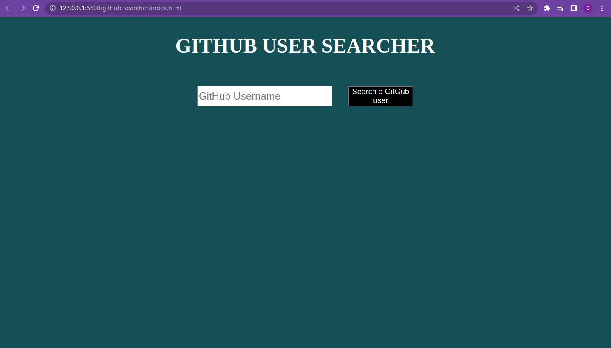
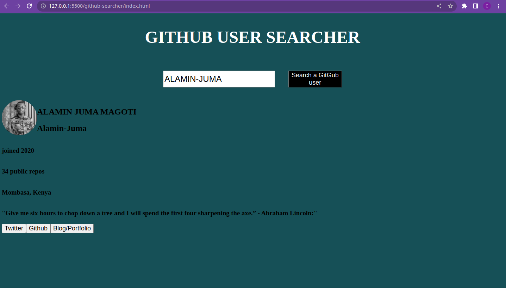
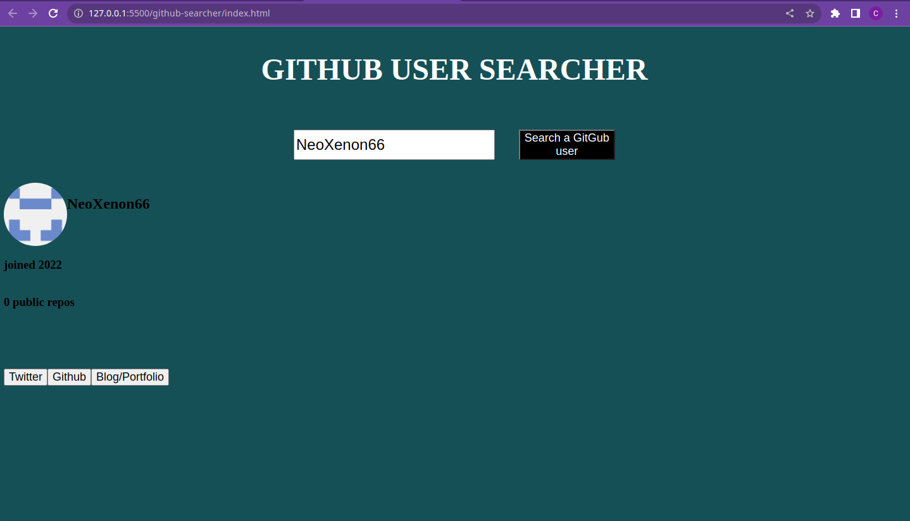
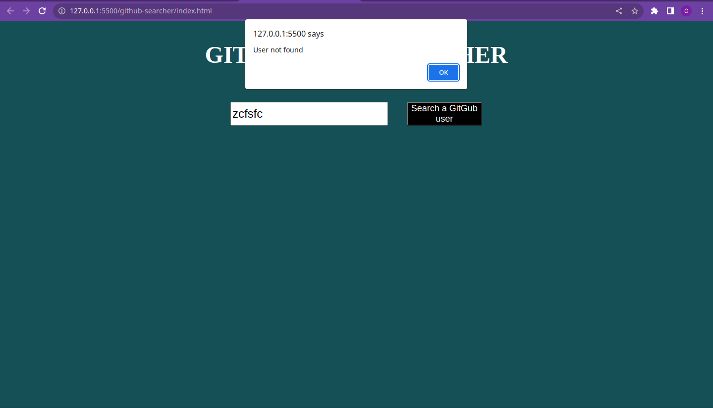

# Github user searcher

# Shows profile picture, name, username, number of public repos, location etc. Also has buttons to open github profile,twitter and blog or portfolio

# If some of these are not available it will ommit them, or alert when you use the buttons

# If the user is not found it will display a pop-up or alert saying user not found

# The link to the site is down below
[Link to website](https://neoxenon66.github.io/github-user-searcher/)
